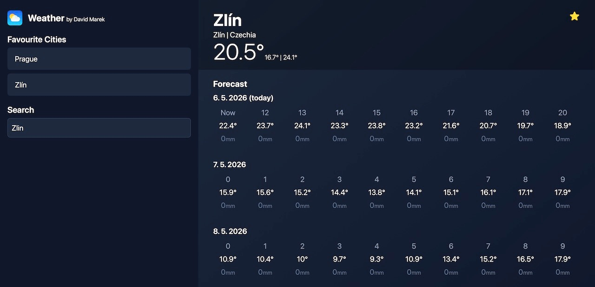

# Weather App

A weather forecast app built with React. Users can search for any city, view hourly temperature and rain data for the coming days, and save favourite cities for quick access. Weather data is pulled from the free [Open-Meteo API](https://open-meteo.com/) — no API key required.

**Live demo:** https://davmarek-weather.vercel.app

**Stack:** React, TypeScript, Vite, TailwindCSS, TanStack Query



---

## Running the project

**Install packages**
```bash
bun install
```

**Run the project**
```bash
bun dev
```

App runs at http://localhost:5173

## Project structure

All source code is in `src/`:
- `src/main.tsx` — app entry point
- `src/App.tsx` — root component
- `src/components/` — UI components (city search, weather detail, favourites)
- `src/helpers/` — data fetching helpers and TypeScript types
